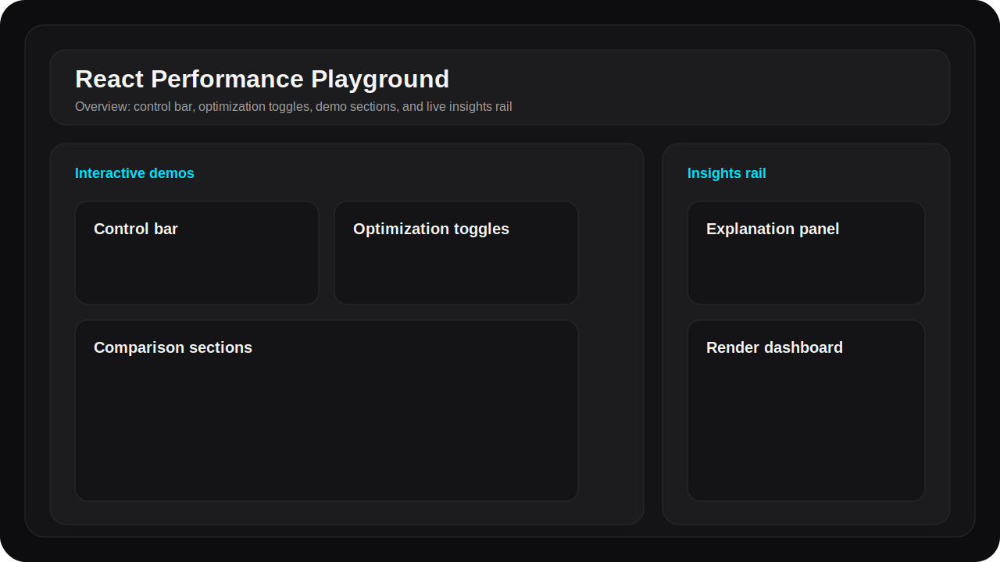
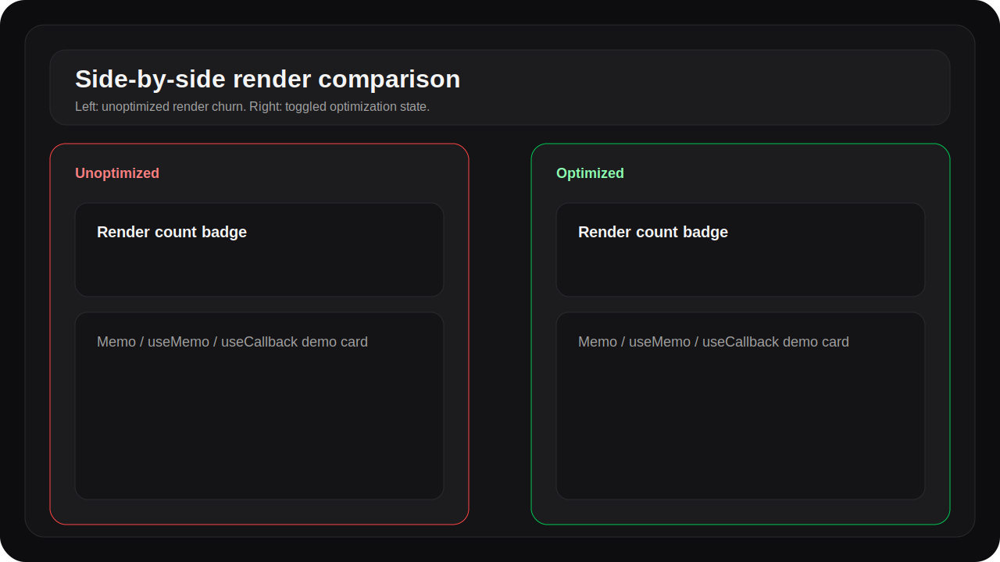
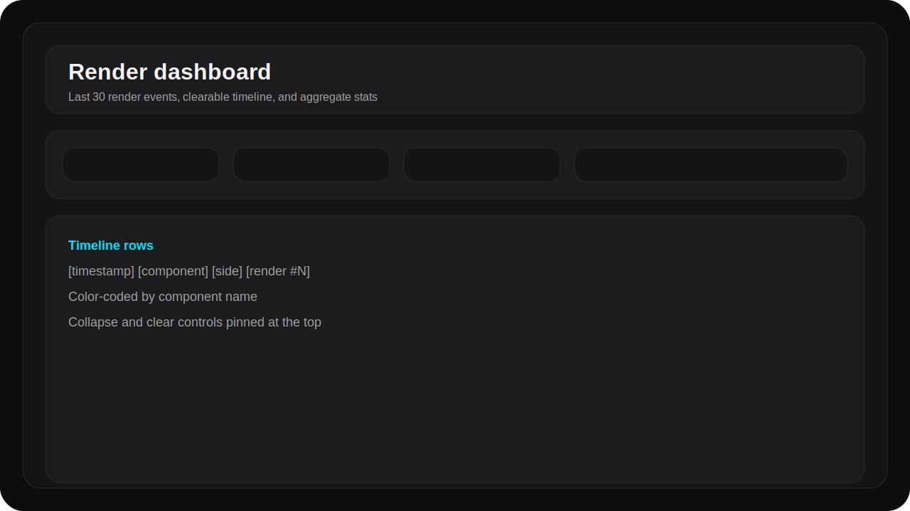

# React Performance Playground

An interactive React 18 + Vite + Tailwind demo that shows how rendering behaves with and without common optimizations.

## Setup

```bash
npm install
npm run dev
```

## What You Get



- A dark developer-tool UI with live render counters.
- Side-by-side comparison cards for `React.memo`, `useMemo`, and `useCallback`.
- A lazy-loading demo built with `React.lazy` and `Suspense`.
- A live explanation rail with code diffs and impact summaries.
- A render dashboard that keeps the last 30 render events visible.



## Feature Walkthrough

### Control bar

- Type in the input to force broad parent re-renders.
- Move the slider to change the stable dependency used by the demos.
- Use the force button to trigger a render without changing visible state.
- Reset returns the playground to its default interaction state.

### Optimization toggles

- `React.memo` removes repeated renders when the child props stay shallow-equal.
- `useMemo` caches the expensive `fibonacci(38)` computation.
- `useCallback` stabilizes callback identity so memoized children can skip renders.

### Lazy loading

- `React.lazy` defers the heavy module fetch until the user asks for it.
- `Suspense` shows the skeleton fallback while the chunk is loading.
- The unload and reload buttons recreate the lazy boundary so the fallback appears again.



### Render dashboard

- Displays the last 30 render events in reverse chronological order.
- Shows aggregate render counts and the optimized vs. unoptimized ratio.
- The clear action resets both the timeline and the per-component render counters.

## Per-Technique Notes

### React.memo

- Without memoization, `ChildA` re-renders whenever its parent re-renders, even if its props do not change.
- With `React.memo`, the child performs a shallow prop comparison and skips work when the label stays stable.
- The render counter should flatten when you type in the input but leave the slider unchanged.

### useMemo

- Without memoization, `ChildB` recomputes `fibonacci(38)` on every render.
- With `useMemo`, the calculation only reruns when `sliderValue` changes.
- The render count can still change, but the expensive computation count should fall sharply.

### useCallback

- Without `useCallback`, the parent creates a fresh handler each render.
- With `useCallback`, the child receives a stable function reference while the dependency stays unchanged.
- This is especially effective when the child itself is memoized.

## Architecture

- `PlaygroundContext` uses `useReducer` for the app controls and toggles.
- `usePlayground()` is the only way the demo tree reads or writes playground state.
- `useRenderTracker()` uses `useRef` for real per-component counters and logs every render into a lightweight external timeline store.
- `useRenderLog()` subscribes to the timeline store for the explanation rail and the dashboard.
- Prism.js powers the JSX code highlighting in the explanation panel.

## Extending the Playground

1. Add a new technique entry in [`src/data/techniques.js`](./src/data/techniques.js).
2. Create a demo component for the new behavior in `src/components/comparison/`.
3. Add the new section to the page in [`src/App.jsx`](./src/App.jsx).
4. Update the explanation rail and dashboard if the new technique needs special metrics.

## Testing

```bash
npm run test
```

- Reducer behavior is covered.
- Render log append and clear behavior is covered.
- Technique metadata shape is covered.
- Lazy loading transitions are covered with fake timers.
